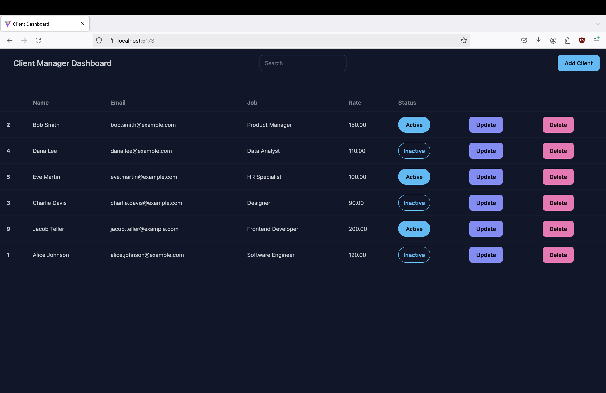
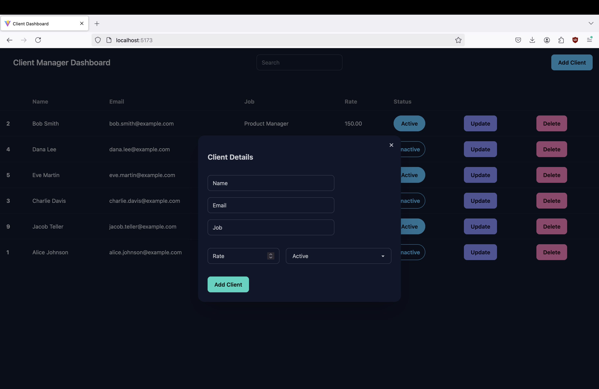
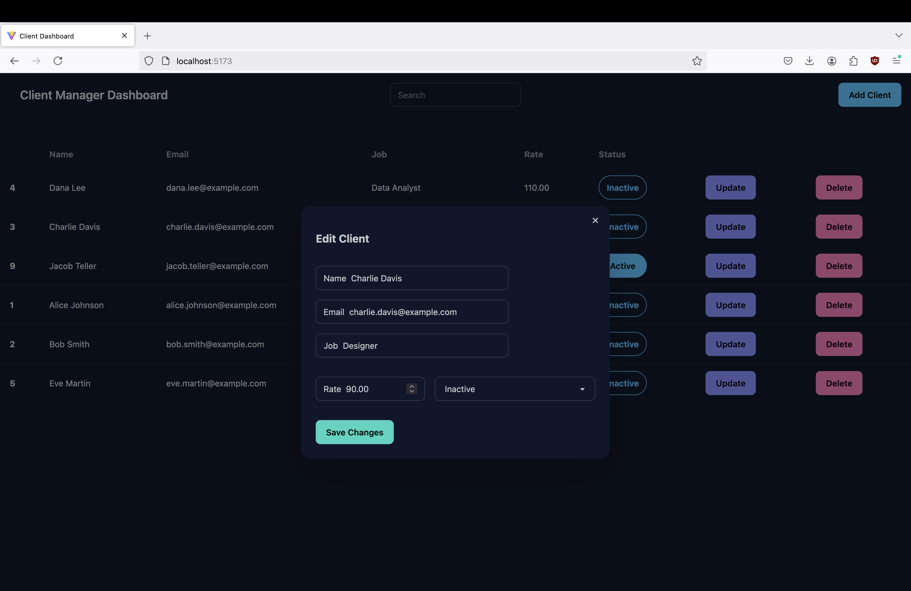

# client-manager-dashboard
This is a client manager dashboard to perform CRUD operations using Node.js, React, Tailwind and PostgreSQL. 

### Tech Stack
**Frontend**:
- React

**Backend**:
- Node.js
- Express
- CORS
- dotenv

**Database**:
- PostgreSQL

**Tools**:
- VS Code
- Postman (for testing APIs)
- GitHub

## Acknowledgements
Credits: [Kenn Onirom](https://www.youtube.com/watch?v=gTD8b5Yxuuo)  
Docs: Helpful notes to setup and implement this project. [Link to Kenn's Google docs](https://docs.google.com/document/d/e/2PACX-1vTfYBAnT9sZ96xjGsozr2Fss03b9xoCUxMH0LE6F7zrmDRmMvhiuNkQtriM6xT_w1uYUfmp0AfbYy21/pub)  

## Interface Overview
- Completed Client Manager Dashboard

- ModalForm to Add Clients

- ModalForm to Update Client

## Notes & Lessons Learned
- Run frontend: npm run dev
- Run backend: npm run start
- Backend:
  - Create folders: services, controllers, routes
  -  CRUD operations works by firstly passing from SERVICES to CONTROLLER to ROUTE to index.js
- Tailwind for styling the website

## Future Improvements
- Add user authentication
- Write unit tests for backend routes
- Deploy using Render or Vercel
